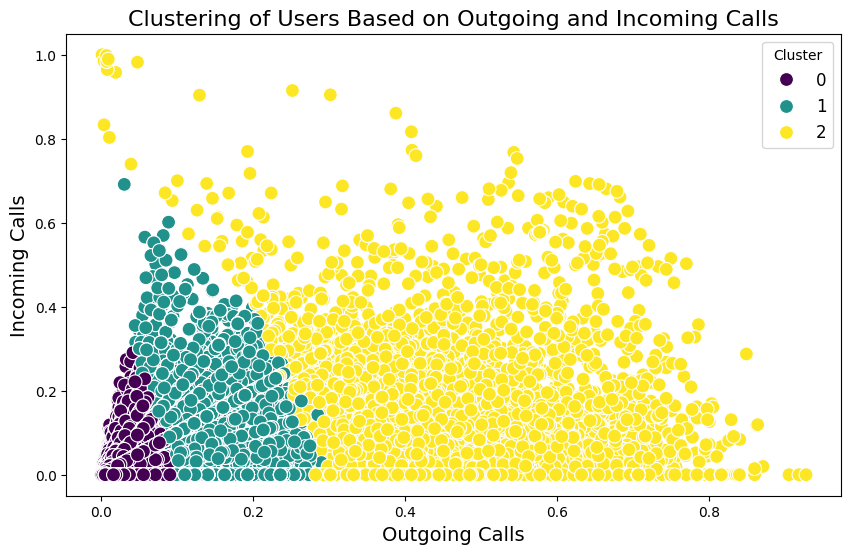
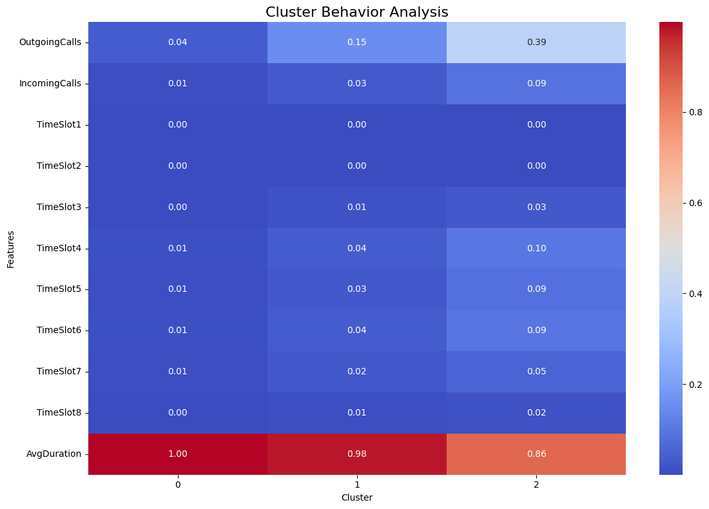

# 地学大数据原理与应用期末项目

### ————用户行为统计与分析项目报告

## 1.引言

随着信息技术的迅速发展，各行各业都积累了大量的数字化数据。这些数据中蕴含着丰富的知识和价值，如何有效地提取和利用这些数据，成为了现代企业和研究领域面临的一个重要课题。数据挖掘作为一种从大规模数据中发现模式、趋势和知识的技术，已经成为决策支持、市场分析、科学研究等多个领域的重要工具。

本报告旨在通过对特定数据集的分析，运用数据挖掘的方法揭示其中潜在的有价值信息。项目的核心目标是通过数据预处理、分析等步骤，分析数据中的关键因素，发现潜在的规律和趋势。

## 2.项目目标与任务

1. 完成用户基本行为的统计：

   - 计算用户的每日平均通话次数，并将结果以<主叫号码, 每日平均通话次数>的格式保存为txt或excel文件

   - 计算出用户在各个时间段（如下表所示）的通话时长比例，并将结果以<主叫号码, 时间段1占比, ..., 时间段8占比>的格式保存成excel文件

     | **时间段1** | **0:00-3:00**    |
     | ----------- | ---------------- |
     | **时间段2** | **3:00-6:00 **   |
     | **时间段3** | **6:00-9:00 **   |
     | **时间段4** | **9:00-12:00 **  |
     | **时间段5** | **12:00-15:00**  |
     | **时间段6** | **15:00-18:00 ** |
     | **时间段7** | **18:00-21:00 ** |
     | **时间段8** | **21:00-24:00 ** |

2. 深度分析用户的行为特征，采用分类、聚类等数据挖掘方法中的任意一种或多种 方法完成用户行为特征分析。

## 3.用户基本行为统计

### 3.1.计算用户的每日平均通话次数

**处理流程**：

1. 从`data.txt`中按给定的格式读取原始数据

   ```javascript
   // 按给定格式读取每行数据
   function parse(raw) {
       const caller_key = 1, callee_key = 2;
       let caller = raw[caller_key];
       let callee = raw[callee_key];
       let info = {
           day_id: raw[0],
           calling_optr: raw[3],
           called_optr: raw[4],
           calling_city: raw[5],
           called_city: raw[6],
           calling_roam_city: raw[7],
           called_roam_city: raw[8],
           start_time: raw[9],
           end_time: raw[10],
           raw_dur: raw[11],
           call_type: raw[12],
           calling_cell: raw[13],
           active: true,
       };
       return [caller, callee, info];
   }
   let data = new Map();
   const raw_datas = await open(path, 'r', 0o666, (err, fd) => {
       if (err) {
       console.log(err);
       return;
   }
   });
   for await (const raw_data of raw_datas.readLines()) {
       let raw_info = raw_data.split('\t');
       let [caller, callee, info] = parse(raw_info);
       data.set(caller, [info])
   }
   ```

   

2. 以`calling_nbr`作为用户数据的主键，统计每个用户的日均通话次数

   ```javascript
   function filter1(value, key, map) {
       this.push({ calling_nbr: key, avg_call_count: (value.length / 29).toFixed(3) });
   }
   let data_filterBy_count = [];
   data.forEach(filter1, data_filterBy_count);
   ```

### 3.2.计算用户在各个时间段的通话时长比例

**处理流程**：

1. 读取之前已读入的数据

   ```javascript
   import { getData, getFilteredData } from './extractor.mjs'
   let [data, cnt] = await getData('./data/data.txt')
   ```

   

2. 以`calling_nbr`作为用户数据的主键，统计每个用户的在各个时间段的通话时长比例

   ```javascript
   function filter2(value, key, map) {
       let seg = {};
       for (let i = 1; i <= 8; i++) {
           seg[`时间段${i}`] = 0;
       }
       value.forEach(ele => {
           let h = parseInt(ele.start_time.split(':')[0]);
           seg[`时间段${Math.floor(h / 3) + 1}`]++;
       });
       let sum = 0;
       Object.values(seg).forEach((val) => { sum += val });
       Object.keys(seg).forEach((val) => { seg[val] /= sum; seg[val] = `${(seg[val] * 100).toFixed(2)}%`; });
       this.push({ calling_nbr: key, ...seg });
   }
   let data_filterBy_time = [];
   data.forEach(filter2, data_filterBy_time);
   ```

### 3.3.将处理好的数据存入excel中

```javascript
import * as XLSX from 'xlsx';
import * as fs from 'fs';
XLSX.set_fs(fs);
const worksheet1 = XLSX.utils.json_to_sheet(data_filterBy_count);
const worksheet2 = XLSX.utils.json_to_sheet(data_filterBy_time);
const workbook = XLSX.utils.book_new();
XLSX.utils.book_append_sheet(workbook, worksheet1, "Counts");
XLSX.utils.book_append_sheet(workbook, worksheet2, "Time");
XLSX.writeFile(workbook, "ans.xlsx"); // 将两组不同数据放入同一个excel下的不同工作页中
```


## 4.数据预处理

本项目采用了用户的外呼次数，接听次数，各时间段中外呼次数，平均外呼通话时间作为用户的主要特征进行分析，为此，需要对数据进行预处理，将上述数据筛选出来，存入`output.txt`

```javascript
function filter3(value, key, map) {
    let seg = {};
    for (let i = 1; i <= 8; i++) {
        seg[`TimeSlot${i}`] = 0;
    }
    let incall = 0, outcall = 0, dur = 0;
    value.forEach(ele => {
        let h = parseInt(ele.start_time.split(':')[0]);
        if (ele.active === true) {
            outcall++; //总外呼次数+1
            seg[`TimeSlot${Math.floor(h / 3) + 1}`]++; // 对应时间段外呼次数+1
            dur += parseInt(ele.raw_dur);
        }
        else if (ele.active === false) {
            incall++;//总接听次数+1
            // 不统计时间段中的接听次数
        }
    });
    if (outcall !== 0)
        this.push({ user_id: key, OutgoingCalls: outcall, IncomingCalls: incall, ...seg, AvgDuration: (dur / outcall) });
}
let filtered = 0;
async function getFilteredData(path) {
    // let [data, cnt] = await getData('./data/data.txt');
    [data, cnt] = await getData(path);
    if (filtered === 0) {
        data.forEach(filter3, filtered_data);
        filtered = 1;
    }
    return filtered_data;
}
let filtered_data = await getFilteredData('./data/data.txt');
const columns = Object.keys(filtered_data[0]);
const header = columns.join('\t');
const rows = filtered_data.map(row => {
    return columns.map(column => row[column]).join('\t');
});
const output = [header, ...rows].join('\n');
fs.writeFileSync('output.txt', output, 'utf-8');
```


## 5.数据分析

本项目采用的数据挖掘方法是聚类，考虑的原因如下：

1. 选取的用户特征的值的种类过多，使用分类算法不可行
2. 在进行分析前不存在预期的类别，聚类算法更加适合

**处理过程**：

1. 读取数据

   ```python
   def load_data(file_path):
       df = pd.read_csv(file_path, sep='\t', usecols=range(1, len(pd.read_csv(file_path, sep='\t', nrows=1).columns)))
       return df
   ```

2. 对数据进行归一化

   由于采用的特征较多，且不同特征的量纲不同，因此需要对数据进行归一化，经过测试，使用`Normalizer`对数据进行归一化处理后，得到的聚类效果相对更好

   ```python
   def normalize_features(df, features):
       scaler = Normalizer()
       df = df.dropna(subset=features)  # 去掉这些包含NaN的行
       df[features] = scaler.fit_transform(df[features])
       return df
   ```

3. 根据肘部法确定较好的聚类数，然后进行聚类分析

   肘部法确定较好的聚类数为3.

   ```python
   def find_optimal_k(df, features):
       inertia = []
       k_range = range(2, 16)  # 测试从 2 到 10 个簇
       for k in k_range:
           kmeans = KMeans(n_clusters=k, random_state=42, n_init=10, max_iter=100)
           kmeans.fit(df[features])
           inertia.append(kmeans.inertia_)
   
       # 绘制肘部法则图
       plt.plot(k_range, inertia, marker='o')
       plt.title('elbow-method fig')
       plt.xlabel('number of clusters')
       plt.ylabel('inertia of clusters')
       plt.savefig("elbow.png", format='png', bbox_inches='tight')
       # 返回肘部法则最佳 K 值
       print(np.argmin(np.diff(inertia)))
   
       optimal_k = k_range[np.argmin(np.diff(inertia)) + 1]  # 找到最佳的 K 值
       print(f"best k: {optimal_k}")
       return optimal_k
   
   
   # 在计算了数据的最优聚类数量后，将数据分配给最近的簇
   def perform_clustering(df, features, n_clusters=3):
       kmeans = KMeans(n_clusters=n_clusters, random_state=42)
       df['Cluster'] = kmeans.fit_predict(df[features])
       print(kmeans.labels_)
       return df, kmeans
   # 聚类结果的散点图（基于 OutgoingCalls 和 IncomingCalls）
   def plot_cluster_scatter(df, save_path=None):
       plt.figure(figsize=(10, 6))
       sns.scatterplot(data=df, x='OutgoingCalls', y='IncomingCalls', hue='Cluster', palette='viridis', s=100)
       plt.title('Clustering of Users Based on Outgoing and Incoming Calls', fontsize=16)
       plt.xlabel('Outgoing Calls', fontsize=14)
       plt.ylabel('Incoming Calls', fontsize=14)
       plt.legend(title='Cluster', fontsize=12)
       if save_path:
           plt.savefig(save_path, format='png', bbox_inches='tight')
       plt.show()
   
   
   # 列举类别行为特征
   def label_clusters(df):
       # 聚类结果的特征均值
       cluster_summary = df.groupby('Cluster').mean()
   
       print("\n每个聚类类别的行为特征：")
       for i in range(len(cluster_summary)):
           print(f"\nCluster {i} behavior:")
           for feature, value in cluster_summary.iloc[i].items():
               print(f"{feature}: {value:.4f}")
   
   # 绘制热力图，便于对比不同类之间的差异
   def plot_heatmap(df, features, title, save_path=None):
       # 计算每个聚类类别的平均值
       cluster_summary = df.groupby('Cluster').mean()
   
       plt.figure(figsize=(12, 8))
       sns.heatmap(cluster_summary[features].T, annot=True, cmap='coolwarm', fmt=".2f")
       plt.title(title, fontsize=16)
       plt.xlabel('Cluster')
       plt.ylabel('Features')
       plt.xticks(rotation=0)
       plt.yticks(rotation=0)
       plt.tight_layout()
       if save_path:
           plt.savefig(save_path, format='png', bbox_inches='tight')
       plt.show()
   
   ```

   

## 6.结果展示

聚类结果的散点图



聚类后各类簇心坐标热力图

